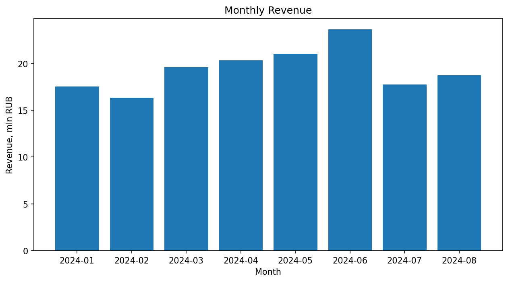
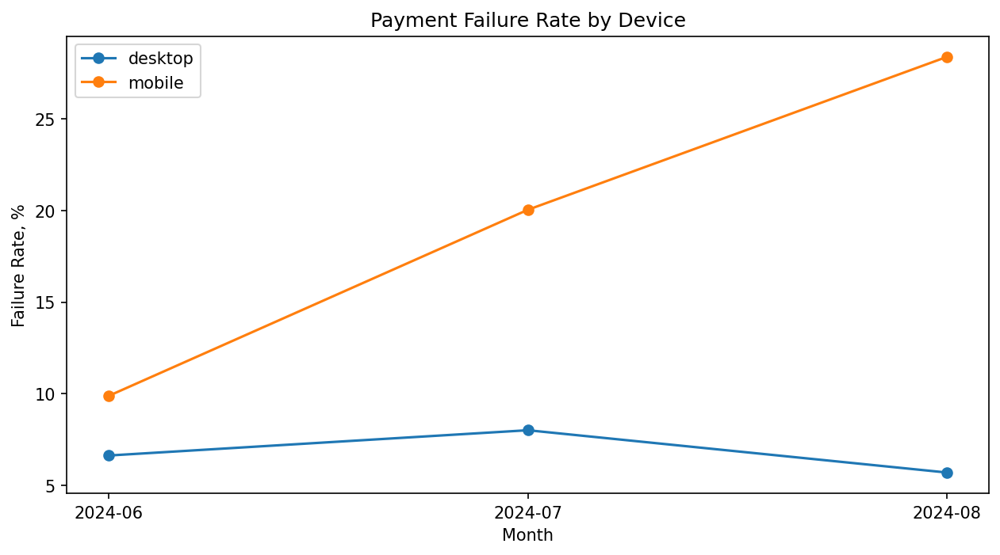
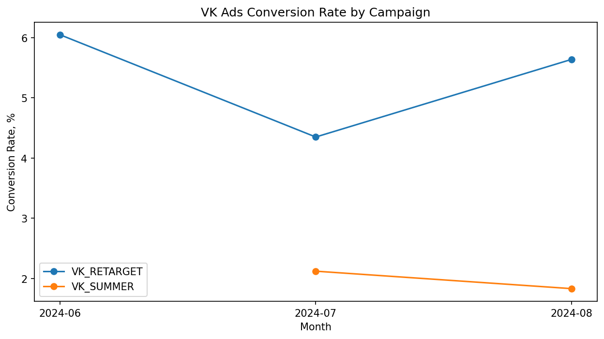
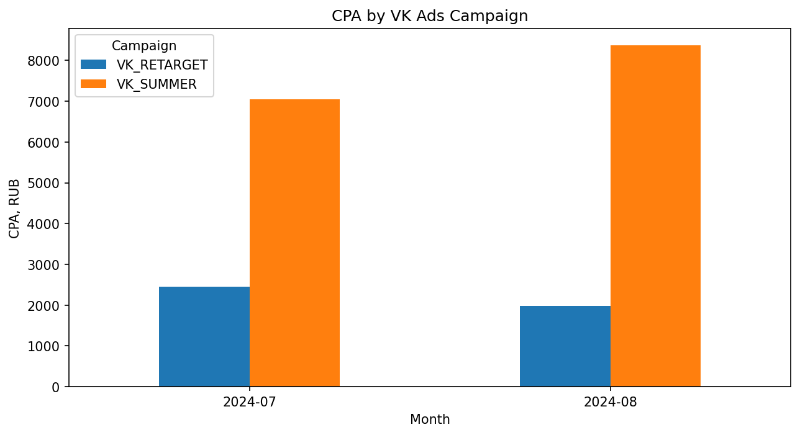
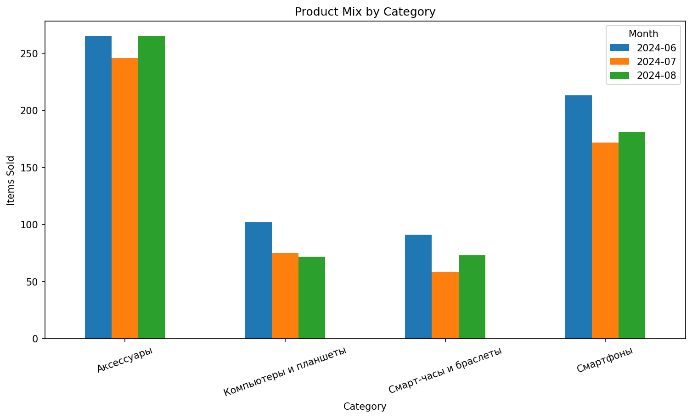

# E-commerce Analysis: iТочка

Анализ e-commerce данных магазина электроники с целью выявить причины ухудшения бизнес-показателей во второй половине анализируемого периода.

## Задача

В ходе анализа необходимо было:

- оценить динамику выручки, заказов, среднего чека и конверсии;
- определить причины снижения Revenue после июня;
- локализовать проблемные этапы пользовательской воронки;
- оценить эффективность рекламных кампаний;
- определить факторы снижения среднего чека;
- оценить потенциальное влияние найденных проблем на заказы и выручку;
- сформулировать рекомендации для бизнеса.

## Период анализа

Январь — август 2024 года.

## Стек

- PostgreSQL
- DBeaver
- Python
- Pandas
- Matplotlib
- Jupyter Notebook

## Данные

Для проекта использован синтетический транзакционный датасет, моделирующий работу российского e-commerce магазина электроники.

В анализе использовались следующие таблицы:

- `customers` — данные о зарегистрированных пользователях;
- `sessions` — пользовательские сессии, каналы привлечения и этапы воронки;
- `orders` — заказы, статусы и финансовые показатели;
- `order_items` — состав заказов и товарные позиции;
- `products` — товарный каталог и категории;
- `payments` — способы оплаты, статусы платежей и причины ошибок;
- `marketing_spend` — рекламные расходы, показы и клики по кампаниям.

Перед бизнес-анализом была проведена проверка качества данных: уникальность ключей, связи между таблицами, NULL, корректность финансовых расчетов, временная последовательность событий и допустимые диапазоны значений.

## Ключевые результаты

### Что произошло

До июня основные бизнес-показатели росли, однако после достижения пика Revenue в июне результаты резко ухудшились.

- Revenue: **23,63 млн ₽ → 17,77 млн ₽ → 18,72 млн ₽**
- Completed orders: **715 → 617 → 629**
- Conversion Rate: **6,24% → 5,05% → 4,99%**
- Average Order Value: **33,05 тыс. ₽ → 28,80 тыс. ₽ → 29,77 тыс. ₽**

При этом количество сессий продолжало расти, поэтому снижение результатов нельзя объяснить недостатком трафика.

---

### 1. Техническая проблема мобильной оплаты

Основное снижение Conversion Rate оказалось сосредоточено на mobile:

- июнь — **6,07%**
- июль — **4,56%**
- август — **3,88%**

При анализе воронки наиболее сильное ухудшение обнаружено на этапе `Checkout → Purchase`:

- **80,58% → 70,53% → 61,54%**

Дальнейший анализ платежей показал резкий рост ошибок банковских карт на mobile.

Failure Rate для mobile card payments вырос:

- июнь — **10,67%**
- июль — **31,98%**
- август — **48,39%**

Главной новой причиной стала ошибка **`3-D Secure / тайм-аут`**. Устойчивая проблема начинает проявляться примерно с 16 июля.

После этой даты найдено **111 affected orders** на сумму около **3,13 млн ₽ potential revenue at risk**.

**Вывод:** вероятная техническая проблема mobile payment flow существенно снижала вероятность завершения покупки после checkout.

---

### 2. Масштабирование неэффективной VK_SUMMER

В июле вместе с ростом общего трафика была запущена новая рекламная кампания `VK_SUMMER`, которая стала формировать около 64% VK Ads-трафика.

При этом качество трафика оказалось значительно ниже, чем у `VK_RETARGET`.

Conversion Rate:

- `VK_RETARGET`: **4,35% в июле → 5,64% в августе**
- `VK_SUMMER`: **2,12% → 1,83%**

Разница наблюдается уже на этапе `Session → Cart`, то есть возникает до checkout и оплаты и не может объясняться только проблемой 3-D Secure.

Различие также проявляется в рекламной эффективности.

В июле:

- `VK_RETARGET`: **CPA 2 453 ₽**, **ROAS 12,82**
- `VK_SUMMER`: **CPA 7 048 ₽**, **ROAS 2,77**

В августе:

- `VK_RETARGET`: **CPA 1 980 ₽**, **ROAS 18,00**
- `VK_SUMMER`: **CPA 8 371 ₽**, **ROAS 3,67**

Benchmark-анализ показал, что при конверсии на уровне `VK_RETARGET` кампания `VK_SUMMER` могла бы получить примерно на **112 completed-заказов больше**, что соответствует около **2,98 млн ₽ потенциальной дополнительной выручки**.

Эта величина является оценочным сценарием, а не фактически потерянной выручкой.

**Вывод:** рост VK Ads-трафика происходил преимущественно за счёт кампании с более низким качеством аудитории и значительно худшей экономической эффективностью.

---

### 3. Снижение Average Order Value связано с product mix

Среднее количество товаров в completed-заказе практически не изменилось:

- июнь — **1,31**
- июль — **1,30**
- август — **1,30**

При этом снизились продажи дорогих категорий.

Количество проданных товаров:

- смартфоны: **213 → 172 → 181**
- компьютеры и планшеты: **102 → 75 → 72**
- смарт-часы и браслеты: **91 → 58 → 73**

Продажи более дешёвых аксессуаров остались относительно стабильными:

- **265 → 246 → 265**

**Вывод:** падение AOV связано не с уменьшением количества товаров в корзине, а со смещением структуры completed-продаж в сторону более дешёвых товаров.

## Рекомендации

### 1. Приоритетно проверить mobile 3-D Secure flow

Начиная примерно с 16 июля наблюдается резкий рост ошибок `3-D Secure / тайм-аут` при оплате банковской картой на mobile.

Рекомендуется:

- проверить релизы checkout и платежной интеграции около 16 июля;
- изучить логи и timeout-сценарии 3-D Secure;
- проверить mobile redirect flow;
- после исправления контролировать Mobile Card Failure Rate и `Checkout → Purchase`.

Ключевые метрики контроля:

- Mobile Bank Card Failure Rate;
- количество ошибок `3-D Secure / тайм-аут`;
- Mobile Checkout → Purchase Conversion.

---

### 2. Пересмотреть масштабирование VK_SUMMER

`VK_SUMMER` привлекает большой объём дешёвого трафика, но значительно уступает `VK_RETARGET` по CR, CPA и ROAS.

Рекомендуется:

- ограничить дальнейшее масштабирование до выяснения причин низкой конверсии;
- проверить таргетинг и аудитории;
- проанализировать креативы и посадочные страницы;
- тестировать отдельные сегменты кампании;
- оценивать эффективность не только по CPC, но и по CR, CPA и ROAS.

Ключевые метрики контроля:

- Cart Rate;
- Conversion Rate;
- CPA;
- ROAS.

---

### 3. Дополнительно исследовать снижение продаж дорогих категорий

Снижение AOV связано со снижением доли дорогих товаров в completed-продажах.

На основании имеющихся данных нельзя однозначно определить причину изменения product mix.

Рекомендуется дополнительно проверить:

- наличие и остатки товаров;
- изменение цен;
- скидки и промо;
- условия рассрочки;
- конверсию по категориям;
- влияние платежных ошибок на дорогие покупки.

Ключевые метрики контроля:

- Average Order Value;
- продажи дорогих категорий;
- Category Conversion Rate;
- средняя стоимость купленного товара.

## Итог

Снижение Revenue после июня оказалось результатом нескольких независимых факторов:

1. технической проблемы при оплате банковской картой на mobile;
2. масштабирования низкоэффективной рекламной кампании `VK_SUMMER`;
3. снижения Average Order Value из-за изменения product mix.

Анализ показал, что рост общего объёма трафика сам по себе не обеспечивал рост бизнеса: одновременно ухудшились качество части привлечённой аудитории и вероятность успешного завершения покупки.